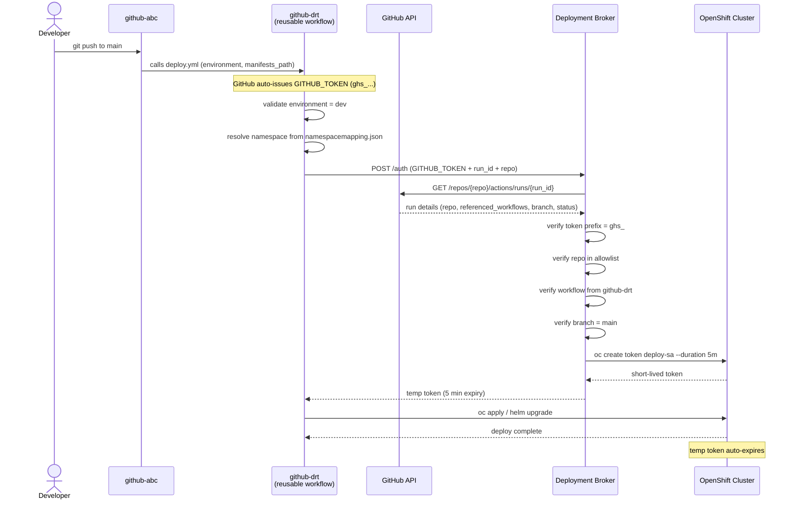

# Secure Cross-Repo Deployment Platform

## Overview

This platform allows any approved repository to deploy to an OpenShift cluster namespace
without ever holding cluster credentials. The deployment workflow is centrally owned and
controlled by `github-drt`. Calling repos only pass an environment and their manifests.

---

## Problem

We need external repos to trigger deployments to our cluster, but:

- Calling repos may be **public** — secrets cannot live there
- We cannot expose the namespace token to any GitHub repo
- We need to control **who** can deploy, **where**, and using **which workflow**

---

## Solution

A lightweight **Deployment Broker** service acts as the trusted middleman.
It holds the cluster credentials and only issues a short-lived token after
verifying the request genuinely came from an approved GitHub Actions run.



---

## Components

### 1. `github-drt` — Reusable Workflow
Central workflow definition owned by the platform team. Callers cannot modify it.

**Inputs:**

| Input | Required | Description |
|---|---|---|
| `environment` | ✅ | Must be `dev` |
| `deploy_type` | ✅ | `oc` or `helm` |
| `manifests_path` | oc only | Path to manifests folder |
| `chart_path` | helm only | Path to helm chart |
| `release_name` | helm only | Helm release name |
| `values_file` | ❌ | Path to helm values file |
| `extra_helm_flags` | ❌ | Extra flags for helm upgrade |
| `build_command` | ❌ | Custom build command (runs before deploy) |

**Steps:**
1. Validate environment (`dev` only)
2. Validate `deploy_type` inputs
3. Checkout `github-drt` and resolve namespace from `namespacemapping.json`
4. Checkout calling repo
5. Run `build_command` if provided — **stops if build fails**
6. Call Deployment Broker with `GITHUB_TOKEN`
7. `oc apply` or `helm upgrade --install` using temp token
8. Verify rollout

---

### 2. `namespacemapping.json` — Namespace Registry
Owned by `github-drt`. Callers cannot modify it. Maps repo + environment → namespace.

```json
{
  "myorg/github-abc": {
    "dev": "namespace1",
    "qat": "namespace2"
  }
}
```

To onboard a new repo — add an entry here. No workflow changes needed.

---

### 3. Deployment Broker — Trust Boundary
A small Python/FastAPI service running inside our infrastructure.
It is the **only place** cluster credentials ever exist.

**Security checks (in order):**

| Check | Detail |
|---|---|
| Token prefix | Must be `ghs_` — rejects PATs, fine-grained tokens |
| GitHub API validation | Confirms token is real and belongs to claimed repo/run |
| Repo allowlist | Repo must be in `ALLOWED_REPOS` |
| Workflow origin | `referenced_workflows` must include `github-drt` |
| Branch check | Must be deploying from `main` |
| Run active | Run must be `in_progress` or `queued` |

If all checks pass → `oc create token deploy-sa --namespace <ns> --duration 5m`

---

### 4. Calling Repo — Minimal Setup

A calling repo needs only this:

```yaml
# .github/workflows/deploy.yml
jobs:
  deploy:
    uses: myorg/github-drt/.github/workflows/deploy.yml@main
    with:
      environment:    "dev"
      deploy_type:    "oc"
      manifests_path: "./manifests"
    permissions:
      contents: read
      actions: read
```

**No secrets. No tokens. No cluster configuration.**

---

## Security Model

| Threat | Mitigation |
|---|---|
| Random actor calls broker | `GITHUB_TOKEN` validated against GitHub API — fake tokens rejected |
| Replay with old token | `GITHUB_TOKEN` expires when the run ends |
| PAT used instead of Actions token | `ghs_` prefix check rejects all PATs |
| Unauthorized repo calls broker | `ALLOWED_REPOS` allowlist enforced |
| Repo uses its own workflow, not ours | `referenced_workflows` check enforced |
| Deploy from a feature branch | Branch must be `main` |
| Token intercepted in transit | 5 min expiry + HTTPS + masked in logs |
| Token scoped too broadly | `deploy-sa` is scoped to one namespace only |

---

## Onboarding a New Repo

1. Add repo + namespace mapping to `namespacemapping.json` in `github-drt`
2. Add `deploy-sa` ServiceAccount to the target namespace:
   ```bash
   oc create serviceaccount deploy-sa -n <namespace>
   oc adm policy add-role-to-user edit -z deploy-sa -n <namespace>
   ```
3. Add the calling workflow to the new repo (see example above)
4. Add repo to `ALLOWED_REPOS` in broker config

---

## What Each Party Holds

| Party | Holds |
|---|---|
| `github-abc` (caller) | Nothing — no secrets, no tokens |
| `github-drt` | Workflow definition + namespace mapping only |
| Deployment Broker | Cluster credentials (never leaves the broker) |
| OpenShift Cluster | `deploy-sa` ServiceAccount per namespace |
